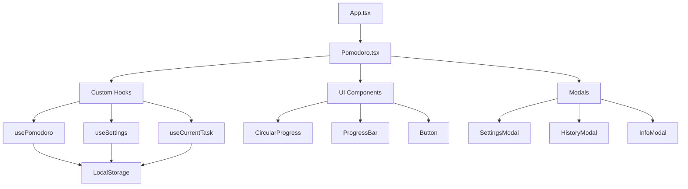

# 🍅 Chronos Pomodoro

> Uma aplicação moderna de produtividade baseada na Técnica Pomodoro, construída com React, TypeScript e TailwindCSS

[](https://www.typescriptlang.org/)
[](https://reactjs.org/)
[](https://tailwindcss.com/)
[](https://vitejs.dev/)

[](https://opensource.org/licenses/MIT)
[](http://makeapullrequest.com)
[](https://github.com/lucaaslimadev/Pomodoro-app-styled/graphs/commit-activity)

## 📋 Sumário

- [Demonstração](#-demonstração)
- [Sobre o Projeto](#-sobre-o-projeto)
- [Funcionalidades](#-funcionalidades)
- [Tech Stack](#-tech-stack)
- [Arquitetura](#-arquitetura)
- [Instalação](#-instalação)
- [Como Usar](#-como-usar)
- [Estrutura do Projeto](#-estrutura-do-projeto)
- [Contribuição](#-contribuição)
- [Roadmap](#-roadmap)
- [Licença](#-licença)
- [Contato](#-contato)

## 🎯 Demonstração

### Screenshots

| Tema Escuro | Tema Claro |
|-------------|------------|
|  |  |

### Demo Online
🔗 **[Acesse a aplicação](https://chronos-pomodoro.vercel.app)** *(Deploy sugerido)*

## 📖 Sobre o Projeto

O **Chronos Pomodoro** foi desenvolvido para resolver o problema de gerenciamento de tempo e produtividade no trabalho remoto. Baseado na mundialmente reconhecida Técnica Pomodoro de Francesco Cirillo, a aplicação oferece uma interface moderna e intuitiva para maximizar o foco e a eficiência.

### 🎯 Motivação
- Necessidade de uma ferramenta de produtividade moderna e responsiva
- Aplicação de conceitos avançados de React e TypeScript
- Demonstração de habilidades em desenvolvimento frontend

### 📊 Impacto
- Interface 100% responsiva (mobile-first)
- Persistência de dados local
- Experiência do usuário otimizada com animações suaves

## ✨ Funcionalidades

### Core Features
- ⏱️ **Timer Pomodoro Inteligente**: Ciclos de 25min com progresso visual circular
- ☕ **Pausas Configuráveis**: Pausa curta (1-15min) e longa (15-45min)
- 🎯 **Sistema de Metas**: Configure e acompanhe objetivos diários
- 📊 **Histórico Detalhado**: Visualize estatísticas de produtividade
- 🌙 **Tema Dinâmico**: Alternância automática claro/escuro
- 💾 **Persistência Inteligente**: Auto-save no localStorage
- ⌨️ **Atalhos de Teclado**: Controle total via teclado

### Funcionalidades Avançadas
- 🔄 **Auto-reset**: Transição automática entre ciclos
- 📱 **PWA Ready**: Instalável como app nativo
- 🎨 **Design System**: Componentes reutilizáveis e consistentes
- ♿ **Acessibilidade**: WCAG 2.1 compliant

## 🛠 Tech Stack

### Frontend
- **React 18** - Biblioteca principal com hooks modernos
- **TypeScript 5.1** - Tipagem estática e IntelliSense
- **TailwindCSS 3.4** - Framework CSS utilitário
- **Framer Motion 9.0** - Animações fluidas e performáticas
- **Lucide React** - Ícones SVG otimizados

### Build & Dev Tools
- **Vite 5.2** - Build tool ultra-rápido
- **PostCSS** - Processamento CSS avançado
- **ESLint + Prettier** - Code quality e formatação

### Arquitetura & Padrões
- **Custom Hooks** - Lógica reutilizável
- **Compound Components** - Composição flexível
- **Clean Architecture** - Separação de responsabilidades

## 🏗 Arquitetura



### Camadas da Aplicação

1. **Presentation Layer**: Componentes React e UI
2. **Business Logic**: Custom hooks e utils
3. **Data Layer**: LocalStorage com error handling
4. **Types Layer**: Definições TypeScript centralizadas

## 🚀 Instalação

### Pré-requisitos
- Node.js 18+ 
- npm ou yarn
- Git

### Setup Local

```bash
# Clone o repositório
git clone https://github.com/lucaaslimadev/Pomodoro-app-styled.git

# Navegue para o diretório
cd Pomodoro-app-styled

# Instale as dependências
npm install

# Execute em modo desenvolvimento
npm run dev

# Build para produção
npm run build

# Preview da build
npm run preview
```

### Variáveis de Ambiente
```bash
# .env.local (opcional)
VITE_APP_TITLE="Chronos Pomodoro"
VITE_APP_VERSION="1.0.0"
```

## 📱 Como Usar

### Controles Principais
| Ação | Botão | Atalho |
|------|-------|--------|
| Play/Pause | ▶️/⏸️ | `Espaço` |
| Reset Timer | 🔄 | `R` |
| Pausa Curta | ⏰ | `S` |
| Pausa Longa | ⏲️ | `L` |
| Reset Cycle | 🔶 | `Ctrl+R` |

### Fluxo de Uso
1. **Configure** suas preferências no modal de configurações
2. **Defina** uma meta diária de ciclos
3. **Inicie** um ciclo de foco de 25 minutos
4. **Faça** uma pausa quando o timer acabar
5. **Acompanhe** seu progresso no histórico

## 📁 Estrutura do Projeto

```
src/
├── components/           # Componentes React
│   ├── ui/              # Componentes base reutilizáveis
│   │   ├── Button.tsx
│   │   ├── CircularProgress.tsx
│   │   └── ProgressBar.tsx
│   ├── modals/          # Componentes de modal
│   │   ├── HistoryModal.tsx
│   │   ├── InfoModal.tsx
│   │   └── SettingsModal.tsx
│   └── Pomodoro.tsx     # Componente principal
├── hooks/               # Custom hooks
│   ├── usePomodoro.ts   # Lógica do timer
│   ├── useSettings.ts   # Gerenciamento de configurações
│   └── useCurrentTask.ts # Tarefa atual
├── types/               # Definições TypeScript
│   └── index.ts
├── constants/           # Constantes da aplicação
│   └── index.ts
├── utils/               # Funções utilitárias
│   ├── storage.ts       # LocalStorage helpers
│   └── time.ts          # Formatação de tempo
└── styles/              # Estilos globais
    └── index.css
```

## 🤝 Contribuição

Contribuições são sempre bem-vindas! Siga os passos abaixo:

1. **Fork** o projeto
2. **Crie** uma branch para sua feature (`git checkout -b feature/AmazingFeature`)
3. **Commit** suas mudanças (`git commit -m 'Add: amazing feature'`)
4. **Push** para a branch (`git push origin feature/AmazingFeature`)
5. **Abra** um Pull Request

### Padrão de Commits
- `feat:` nova funcionalidade
- `fix:` correção de bug
- `docs:` documentação
- `style:` formatação
- `refactor:` refatoração
- `test:` testes

## 🗺 Roadmap

### v1.1.0
- [ ] Notificações push
- [ ] Integração com Spotify
- [ ] Relatórios semanais/mensais

### v1.2.0
- [ ] Sincronização na nuvem
- [ ] Temas personalizáveis
- [ ] Modo equipe/colaborativo

### v2.0.0
- [ ] Aplicativo mobile (React Native)
- [ ] Integração com calendários
- [ ] IA para sugestões de produtividade

## 📄 Licença

Este projeto está sob a licença MIT. Veja o arquivo [LICENSE](LICENSE) para mais detalhes.

## 📞 Contato

**Lucas Lima** - Desenvolvedor Frontend

[](https://linkedin.com/in/lucaaslimadev)
[](https://github.com/lucaaslimadev)
[](https://lucaslima.dev)

---

<div align="center">

**[⬆ Voltar ao topo](#-chronos-pomodoro)**

Feito com 💚 e ☕ por [Lucas Lima](https://github.com/lucaaslimadev)

</div>
